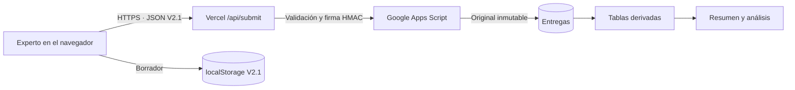

# Arquitectura y operación

## Componentes



- `src/validacion-expertos/`: fuente del instrumento, modelo de estado, interfaz y estilos.
- `src/validacion-expertos/build.mjs`: genera el HTML autónomo y `public/index.html`.
- `public/`: artefacto servido por Vercel.
- `api/submit.mjs`: valida la entrega, utiliza la versión del instrumento del servidor, firma el contenido y comprueba el justificante.
- `api/progress.mjs`: envía únicamente contadores agregados de pantalla y día.
- `google-apps-script/Code.gs`: receptor vinculado al libro privado y generador de tablas.
- `test-support/`: instrumentos históricos y simuladores usados en pruebas.

## Flujo de una entrega

1. El navegador valida consentimiento, correo, esquema y estado de la respuesta.
2. La API de Vercel vuelve a validar los campos y sustituye el instrumento recibido por la copia del servidor.
3. Vercel serializa y firma el contenido con `GOOGLE_SHEETS_SECRET`.
4. Apps Script verifica la firma y la versión.
5. `Entregas` recibe el original codificado en Base64 y dividido entre celdas.
6. Google fuerza la escritura pendiente antes de devolver éxito.
7. El receptor reconstruye las tablas usando la última revisión de cada participante y versión.
8. La API solo confirma el envío cuando recibe un justificante que coincide con la huella esperada.

Los reintentos del mismo contenido devuelven el mismo justificante. Un contenido corregido genera otra entrega y las vistas pasan a mostrar la revisión más alta.

## Entornos y direcciones

- Aplicación pública: [https://diagnostico-startup.vercel.app/](https://diagnostico-startup.vercel.app/)
- Repositorio: [https://github.com/goncazasa/diagnostico-startup](https://github.com/goncazasa/diagnostico-startup)
- Libro privado de resultados: [Google Sheets](https://docs.google.com/spreadsheets/d/18ONMnSUKiRuK51pZVoy8FiaZWkiurZ_Nxsh5jBrJXpY/edit)
- Proyecto de Apps Script: identificador `1-w3kckEUjLOBmSKskhFMKoWdeQsxdMfVnWpuI-a1mQBS35jmo8rwHlL1`
- Implementación web de Apps Script: se mantiene el mismo identificador para no cambiar la variable de Vercel; la versión documentada al 8 de septiembre de 2026 es `@7`.

El libro y Apps Script deben permanecer privados. La aplicación web de Apps Script acepta peticiones anónimas porque los expertos no inician sesión en Google, pero no expone ninguna operación de lectura y rechaza contenido sin firma válida.

## Variables privadas

Vercel necesita:

```text
GOOGLE_SHEETS_WEBHOOK_URL
GOOGLE_SHEETS_SECRET
```

No deben añadirse al repositorio, al HTML, a capturas o a mensajes. El secreto se guarda también como propiedad de Apps Script. El `SHEET_ID` identifica el libro y tampoco es necesario en el navegador.

## Despliegue

### Web y API

La rama `main` está conectada a Vercel. Cada push ejecuta el constructor definido en `vercel.json` y publica `public/` junto con las funciones de `api/`.

```sh
node src/validacion-expertos/build.mjs
node --test src/validacion-expertos/*.check.cjs
git push origin main
```

Se debe comprobar el estado del deployment y realizar una entrega marcada como prueba cuando cambien la API, el esquema o el receptor.

### Apps Script

Apps Script no se despliega desde Vercel ni automáticamente desde GitHub. Cuando cambia `google-apps-script/Code.gs`:

1. actualizar el código del proyecto vinculado;
2. crear una versión nueva de la misma implementación web;
3. conservar la URL terminada en `/exec`;
4. reintentar una entrega de prueba para reconstruir las tablas;
5. comprobar `Resumen`, `Entregas`, `CalidadDatos` y `ValidezContenido`.

Guardar el editor sin actualizar la implementación no modifica el receptor que usa producción.

## Pruebas y controles

La suite cubre modelo, interfaz, API, receptor y contrato V2.1. Al cierre documentado ejecuta 64 pruebas automatizadas. Entre otros casos verifica:

- validación de importación, versión y puntuaciones;
- navegación, guardado, concurrencia de pestañas y recuperación;
- envío correcto, fallos, reintentos y justificantes;
- firma y rechazo de peticiones no autorizadas;
- conservación del original ante fallos de análisis;
- Unicode, fórmulas maliciosas y división de archivos grandes;
- selección de la última revisión y preservación del archivo V1.9;
- aplicabilidad, cribado y revisión de diseño;
- exclusión de testing, CVI, kappa, calidad y comentarios.

Las pruebas de navegador verifican además un recorrido completo con el HTML construido. Las simulaciones no sustituyen una comprobación real tras cambios de infraestructura.

## Recuperación y mantenimiento

- **No editar ni borrar `Entregas`.** Es la fuente para reconstruir todo lo demás.
- Las tablas derivadas pueden regenerarse con **Validación de expertos → Actualizar tablas de análisis**.
- Si `ANALYSIS_PENDING=true` en las propiedades de Apps Script, existe un original guardado cuya reconstrucción no terminó. Reintentar la misma entrega o ejecutar el menú.
- No añadir notas manuales en tablas derivadas: se borrarán durante la reconstrucción. Crear una pestaña independiente.
- Exportar periódicamente el libro completo y registrar el commit y la fecha del corte.
- Antes de una nueva versión, conservar el receptor capaz de leer los archivos históricos ya archivados.

## Datos ficticios actuales

La hoja contiene doce perfiles de demostración con nombres `DATOS DE TESTING` e identificadores `testing-v21-20260908-*`. Sirven para revisar diseño, tablas y rendimiento. Están marcados con `es_testing=true` y excluidos de `ValidezContenido`.

No es necesario borrarlos para comenzar el panel si se mantienen las reglas actuales. Para una exportación destinada a terceros, filtrar `es_testing=false` y retirar las columnas de contacto que no sean necesarias.
